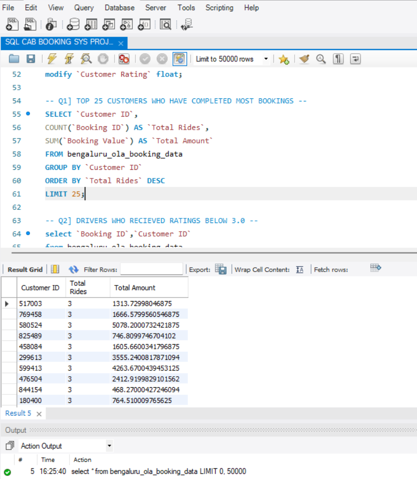
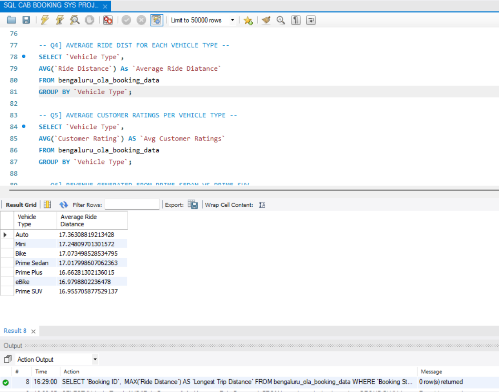
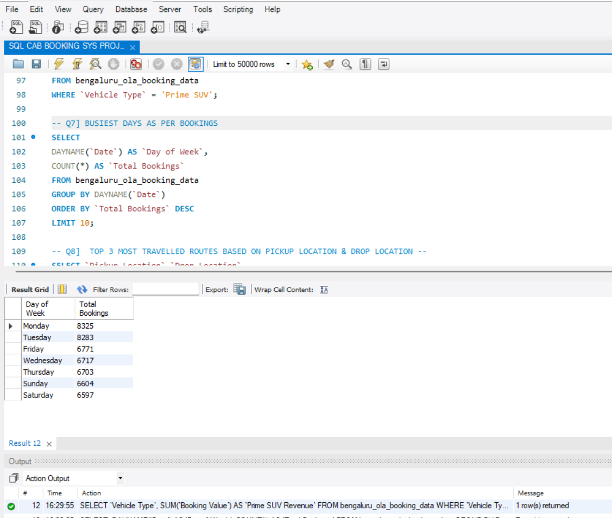

# Bengaluru-Ola-Ride-Booking-Data-Analytics

### 📑 Table of Contents
- [Project Overview](#project-overview)
- [Objective](#objective)
- [Problem Statement](#problem-statement)
- [Dataset & Data Description](#dataset--data-description)
- [Data Cleaning & Preparation](#data-cleaning--preparation)
- [Tools & Technologies](#tools--technologies)
- [SQL Analysis and Queries](#sql-analysis--queries)
- [Key Questions Answered](#key-questions-answered)
- [Key Findings & Business Insights](#key-findings--business-insights)
- [Project Screenshots](#project-screenshots)
- [Project Structure](#project-structure)
- [Conclusion](#conclusion)
- [Additional Analysis Opportunities](#additional-analysis-opportunities)
- [Author](#author)
---

### 📈 Project Overview
The Ola Cab Booking SQL Data Analytics Project is a data analysis project developed using MySQL to explore cab booking information for Bengaluru.
The project examines customer booking patterns, driver ratings, ride distances, vehicle performance, revenue generation, popular routes, booking trends, and customer cancellation reasons.
SQL queries are used to clean and prepare the data, aggregate booking information, compare vehicle categories, and extract business insights that can help improve operational efficiency and customer satisfaction.

---

### 🎯 Objective
The primary objective of this project is to use SQL to analyze Ola cab booking data and identify patterns that can support better business decisions.
The analysis aims to:
- Identify customers with the highest number of completed rides.
- Examine bookings associated with low driver ratings.
- Identify the longest completed trips.
- Compare average ride distances and customer ratings across vehicle types.
- Compare revenue generated by Prime Sedan and Prime SUV.
- Determine the busiest days of the week.
- Identify the most frequently travelled pickup and drop-off routes.
- Understand the most common customer cancellation reasons.
---

### ❓ Problem Statement
A cab-booking business needs to understand booking demand, customer behavior, vehicle performance, driver service quality, revenue distribution, and ride cancellations to operate efficiently.
Without structured analysis, it can be difficult to determine which customers book most frequently, which vehicle categories perform well, when booking demand is highest, which routes receive the most bookings, and why customers cancel rides.
This project uses SQL queries to explore these questions and translate booking data into actionable business recommendations.

---


### 📂 Dataset & Data Description
| Column Name | Data Type | Description |
|---|---|---|
| Booking ID | VARCHAR(10) | Unique identifier for a booking. |
| Customer ID | INT | Identifier for a customer. |
| Date | DATE | Date associated with the booking. |
| Time | TIME | Time associated with the booking. |
| Booking Status | VARCHAR(25) | Status of the booking, such as completed, cancelled, or incomplete. |
| Vehicle Type | VARCHAR(20) | Category of vehicle booked, such as Auto, Mini, Bike, Prime Sedan, or Prime SUV. |
| Pickup Location | VARCHAR(8) | Location where the ride starts. |
| Drop Location | VARCHAR(8) | Destination of the ride. |
| Avg VTAT | TIME | Average vehicle time of arrival, as defined by the dataset. |
| Avg CTAT | TIME | Average customer time of arrival, as defined by the dataset. |
| Cancelled Rides by Customer | INT | Indicator or count of rides cancelled by customers. |
| Reason for Cancelling by Customer | VARCHAR(50) | Reason recorded for customer cancellation. |
| Cancelled Rides by Driver | INT | Indicator or count of rides cancelled by drivers. |
| Reason for Cancelling by Driver | VARCHAR(50) | Reason recorded for driver cancellation. |
| Incomplete Rides | INT | Indicator or count of incomplete rides. |
| Incomplete Rides Reason | VARCHAR(50) | Reason recorded for an incomplete ride. |
| Booking Value | FLOAT | Monetary value associated with a booking. |
| Payment Method | VARCHAR(10) | Payment method used for the booking. |
| Ride Distance | FLOAT | Recorded distance travelled during the ride; the measurement unit should be verified against the source dataset. |
| Driver Ratings | FLOAT | Rating given to the driver for the booking. |
| Customer Rating | FLOAT | Customer rating associated with the ride experience. |

---

### 🧹 Data Cleaning & Preparation
The data preparation process includes:
1. Creating a dedicated database.
2. Inspecting the table structure and existing data types.
3. Standardizing date values.
4. Converting columns to appropriate data types.
5. Reviewing missing and invalid values.
6. Checking duplicate booking IDs and inconsistent categories.
7. Validating the data before analysis.
---

### Database Setup
```sql
CREATE DATABASE ola_database;
USE ola_database;
SHOW TABLES;
SELECT *
FROM bengaluru_ola_booking_data;
```
```sql
DESCRIBE bengaluru_ola_booking_data;
Date Standardization
The following example assumes the original dates follow the month-day-year format after replacing slashes with hyphens.

UPDATE bengaluru_ola_booking_data
SET `Date` = REPLACE(`Date`, '/', '-');

UPDATE bengaluru_ola_booking_data
SET `Date` = STR_TO_DATE(`Date`, '%m-%d-%Y');

ALTER TABLE bengaluru_ola_booking_data
MODIFY COLUMN `Date` DATE;
```

### 🛠️ Tools & Technologies
- MySQL: Database creation, data preparation, and SQL analysis.
- MySQL Workbench: SQL development environment for running queries and viewing results.

### 🔍 SQL Analysis & Queries
 The following nine questions demonstrate how SQL can be used to analyze cab booking data. The queries below use the bengaluru_ola_booking_data table.

### Q1: Top 25 Customers by Completed Bookings
Business question: Which customers have the highest number of completed rides, and what is their total booking value?
```sql
SELECT
    `Customer ID`,
    COUNT(`Booking ID`) AS `Total Rides`,
    SUM(`Booking Value`) AS `Total Amount`
FROM bengaluru_ola_booking_data
WHERE `Booking Status` = 'Completed'
GROUP BY `Customer ID`
ORDER BY `Total Rides` DESC, `Customer ID`
LIMIT 25;
-- This query ranks customers by completed ride count and displays their aggregate booking value. The completed-status filter is necessary for the query to match the business question.
```

Q2: Bookings with Driver Ratings Below 3.0
Business question: Which bookings received a driver rating below 3.0?
```sql
SELECT
    `Booking ID`,
    `Customer ID`,
    `Driver Ratings`
FROM bengaluru_ola_booking_data
WHERE `Driver Ratings` < 3.0
ORDER BY `Driver Ratings` ASC;
-- The query identifies low-rated bookings for service-quality investigation. The supplied columns do not include an explicit driver ID, so this query identifies bookings rather than individual drivers.
```

Q3: Top 5 Longest Completed Trips
Business question: What are the five longest completed rides by distance?
```sql
SELECT
    `Booking ID`,
    `Ride Distance` AS `Longest Trip Distance`
FROM bengaluru_ola_booking_data
WHERE `Booking Status` = 'Completed'
  AND `Ride Distance` IS NOT NULL
ORDER BY `Ride Distance` DESC
LIMIT 5;
-- The query returns the five completed bookings with the largest recorded ride distances. It assumes one row per booking; if a booking can have multiple records, aggregate the distance by booking ID first.
```

Q4: Average Ride Distance by Vehicle Type
Business question: How does the average ride distance differ across vehicle categories?
```sql
SELECT
    `Vehicle Type`,
    ROUND(AVG(`Ride Distance`), 2) AS `Average Ride Distance`
FROM bengaluru_ola_booking_data
WHERE `Ride Distance` IS NOT NULL
GROUP BY `Vehicle Type`
ORDER BY `Average Ride Distance` DESC;
-- This query compares average recorded ride distance across vehicle categories. Apply a completed-booking filter if the intended metric is average distance for completed rides only.
```
Q5: Average Customer Ratings by Vehicle Type
Business question: What average customer rating is recorded for each vehicle category?
```sql
SELECT
    `Vehicle Type`,
    ROUND(AVG(`Customer Rating`), 2) AS `Avg Customer Ratings`
FROM bengaluru_ola_booking_data
WHERE `Customer Rating` IS NOT NULL
GROUP BY `Vehicle Type`
ORDER BY `Avg Customer Ratings` DESC;
-- The query compares customer ratings across vehicle categories. Consider reporting the number of ratings alongside the average so categories with few observations are not overinterpreted.
```
Q6: Prime Sedan vs. Prime SUV Revenue
Business question: How does total booking value compare between Prime Sedan and Prime SUV?
```sql
SELECT
    `Vehicle Type`,
    ROUND(SUM(`Booking Value`), 2) AS `Total Revenue`
FROM bengaluru_ola_booking_data
WHERE `Vehicle Type` IN ('Prime Sedan', 'Prime SUV')
GROUP BY `Vehicle Type`
ORDER BY `Total Revenue` DESC;
-- The query compares the sum of recorded booking values for the two premium vehicle categories. If the intended metric is revenue from completed rides, add AND Booking Status = 'Completed' to the WHERE clause. Booking value should not automatically be treated as recognized revenue without confirming the business definition.
```
Q7: Busiest Days of the Week
Business question: Which days have the highest number of bookings?
```sql
SELECT
    DAYNAME(`Date`) AS `Day of Week`,
    COUNT(*) AS `Total Bookings`
FROM bengaluru_ola_booking_data
WHERE `Date` IS NOT NULL
GROUP BY DAYNAME(`Date`)
ORDER BY `Total Bookings` DESC;
-- The query ranks weekdays and weekends by the number of booking records. It counts all recorded bookings, including potentially cancelled or incomplete rides; filter by booking status if the goal is to measure completed-trip demand.
```
Q8: Top 3 Most Travelled Routes
Business question: Which pickup and drop-off location pairs appear most frequently?
```sql
SELECT
    `Pickup Location`,
    `Drop Location`,
    COUNT(*) AS `Total Trips`
FROM bengaluru_ola_booking_data
WHERE `Pickup Location` IS NOT NULL
  AND `Drop Location` IS NOT NULL
GROUP BY
    `Pickup Location`,
    `Drop Location`
ORDER BY `Total Trips` DESC
LIMIT 3;
-- The query identifies the three most frequent pickup-to-drop-off pairs in the dataset. For completed-trip route demand, filter the records using Booking Status = 'Completed'.
```
Q9: Top 2 Customer Cancellation Reasons
Business question: What are the two most frequently recorded reasons for customer cancellations?
```sql
SELECT
    `Reason for Cancelling by Customer`,
    COUNT(*) AS `Total Cancellations`
FROM bengaluru_ola_booking_data
WHERE `Reason for Cancelling by Customer` IS NOT NULL
  AND TRIM(`Reason for Cancelling by Customer`) <> ''
GROUP BY `Reason for Cancelling by Customer`
ORDER BY `Total Cancellations` DESC
LIMIT 2;
-- Sorting in descending order ensures that the query returns the most frequent cancellation reasons rather than the least frequent ones. Check the dataset's cancellation indicators or booking status if you need to ensure that every counted record represents an actual cancellation.
```
### 💡 Key Findings & Business Insights
The following observations are based on the supplied SQL results and the initial interpretations provided with the project. Validate each conclusion against the complete dataset before using it in a formal business report.

1. Vehicle Preferences
The initial project notes suggest that Auto, Mini, and Bike are popular options.
- Business implication: Compare booking volumes, average booking value, ride distance, and cancellation rates across these categories before deciding where to expand vehicle availability. Booking popularity alone does not establish that a category has lower fares.
2. Prime Sedan vs. Prime SUV
The initial analysis suggests that Prime Sedan generates higher booking value than Prime SUV.
- Business implication: Compare completed-ride revenue, number of completed rides, average fare, and utilization for both categories before allocating additional vehicles or marketing budgets.
3. Booking Demand by Day
The displayed SQL results show Monday with 8,325 bookings and Tuesday with 8,283 bookings. Friday, Wednesday, and Thursday also appear among the higher-volume days in the displayed results.
- Business implication: Consider demand-based driver scheduling and vehicle allocation on high-volume days. Use hourly booking trends and completed rides to determine the actual staffing requirements.
4. Popular Routes
The initial project notes identify several location codes, including 7, 8, 9, 36, 43, and 44, as areas of interest.
- Business implication: Use the top-route query to verify specific pickup and drop-off pairs. Route-level demand can help with driver positioning and supply planning, but location codes should be mapped to real locations before operational decisions are made.
5. Customer Cancellation Reasons
The initial notes highlight wrong addresses and driver requests to cancel as reasons to investigate.
- Business implication: Improve pickup-location confirmation, provide clearer cancellation procedures, and investigate drivers repeatedly requesting cancellations. Confirm the top reasons using the descending-count query before prioritizing corrective actions.
6. Driver Service Quality
Bookings with driver ratings below 3.0 can be examined to identify possible service-quality issues.
- Business implication: Review low-rated bookings alongside cancellation history, vehicle category, trip details, and customer feedback. A booking-level rating alone does not establish the cause of poor service.
---

### 📸 Project Screenshots

### Customer Booking Analysis

- This screenshot demonstrates the customer-level aggregation query in MySQL Workbench.

--- 
### Average Ride Distance Analysis

- This screenshot shows the average recorded ride distance for different vehicle categories.

---
### Booking Trends Analysis

- This screenshot demonstrates the weekday booking-count analysis, including the higher counts displayed for Monday and Tuesday.

---

### 📂 Project Structure
<p>Ola-Cab-Booking-SQL-Data-Analytics/</p>
<p>├── README.md</p>
<p>├── data/</p>
<p>│   └── bengaluru_ola_booking_data.csv</p>
<p>├── sql/</p>
<p>│   ├── 01_database_setup.sql</p>
<p>│   ├── 02_data_cleaning.sql</p>
<p>│   └── 03_ola_booking_analysis.sql</p>
<p>├── images/</p>
<p>│   ├── customer_analysis.png</p>
<p>│   ├── vehicle_distance_analysis.png</p>
<p>│   └── booking_trends_analysis.png</p>
<p>└── documentation/</p>
<p>    ├── data_dictionary.md</p>
<p>    └── project_summary.md</p>

### Conclusion
- This project demonstrates how MySQL can be used to explore cab booking data and answer business questions about customer activity, driver ratings, ride      distances, vehicle categories, booking value, demand patterns, popular routes, and cancellation reasons.
- The analysis provides a starting point for understanding booking operations and identifying areas that deserve further investigation. Reliable business recommendations should be based on validated data, clearly defined metrics, and appropriate filters for completed, cancelled, and incomplete rides.
---

### 🚀 Additional Analysis Opportunities
Future improvements could include:
- Booking completion rate: Calculate completed bookings as a percentage of all bookings.
- Cancellation analysis: Compare cancellation rates by customer, driver, vehicle type, and time of day.
- Route analysis: Investigate the most frequent routes and their cancellation rates.
- Customer segmentation: Group customers according to ride frequency and total booking value.
- Data quality checks: Check duplicate booking IDs, missing values, invalid dates, and inconsistent categories.
- Visualization: Build a dashboard in Power BI, Tableau, or Excel to present the findings.
---

### 👤 Author
***Imran Modi***
